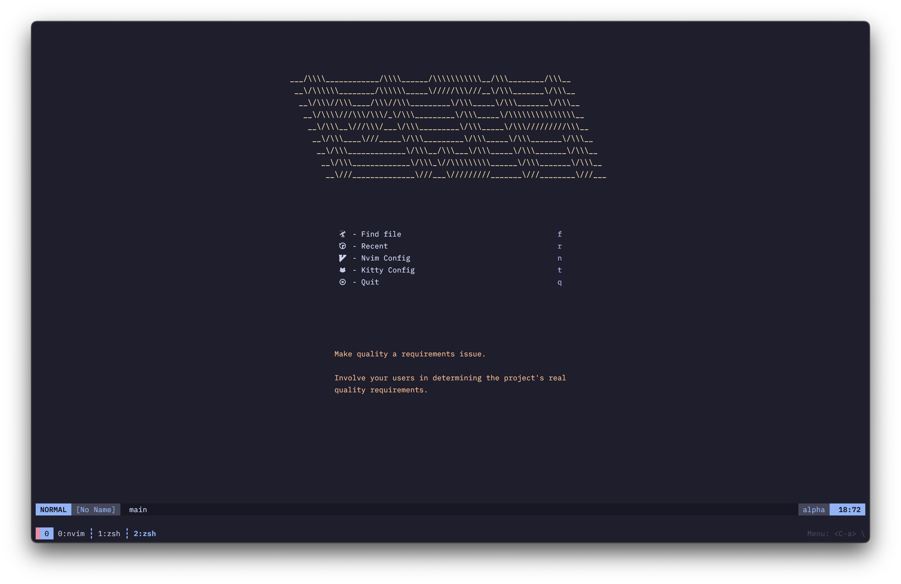
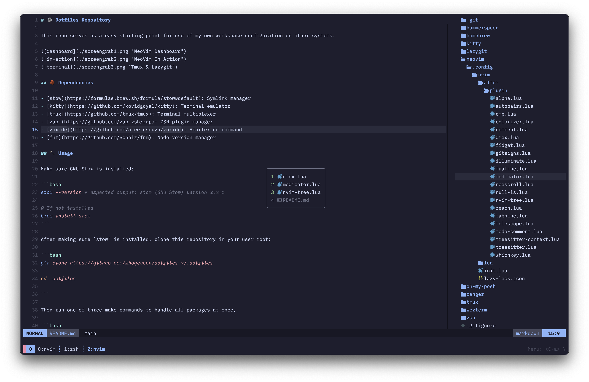

# Dotfiles Repository

This repo serves as a easy starting point for use of my own workspace configuration on other systems.





## Tools

- [stow](https://formulae.brew.sh/formula/stow#default): Symlink manager
- [wezterm](https://github.com/wez/wezterm): Terminal emulator
- [zap](https://github.com/zap-zsh/zap): ZSH plugin manager
- [zoxide](https://github.com/ajeetdsouza/zoxide): Smarter `cd` command
- [fnm](https://github.com/Schniz/fnm): Node version manager

## Usage

Make sure GNU Stow is installed:

```bash
stow --version # expected output: stow (GNU Stow) version x.x.x

# If not installed
brew install stow
```

After making sure `stow` is installed, clone this repository in your user root:

```bash
git clone https://github.com/mhogeveen/dotfiles ~/.dotfiles

cd .dotfiles

```

Then run one of three make commands to handle all packages at once,

```bash
make init # stow all dotfiles which will overwrite existing files
# or
make add # restow all dotfiles
# or
make delete # delete all dotfiles (unlink them all)
```

or

```bash
stow --verbose (--adopt or --restow) <package name>
```

Update all brew packages (will build this out more in the future):

```bash
make up
```
